# **Music Quiz**

Music Quiz website is a quick and easy way of entertainment by testing users musical knowledge through music related questions.   
The music quiz will generate twenty questions with three options to choose from, only one of them is correct. If the user gives the correct answer, the answer will  
appear in green and one point will be added to the correct answers counter. If user is incorrect, the option choosen will appear in red and one point will then be   
added to the incorrect counter. The quiz shuffles both questions and rearranges positions of answers to disable user from memorizing the correct answers. 
  
Instructions on how to play is easily accessible at the top of the page by clicking the button "how to play". If users wishes to return to home-page the home button  
is visually placed in the top left corner of page. 

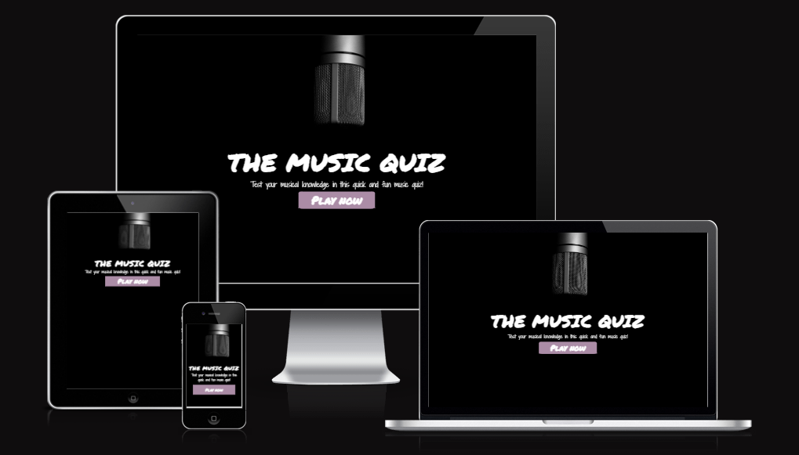

---
## **Features** 

### **Home page**

* The first thing user will see is the homepage before entering the music quiz page
* The background is matched with the main image's dark colors and to contrast that, the font and button are in white and lightpink.
* To give the website a more playful feeling the font for the logo is in handwritten thick permanent marker matched with handwritten Shadow into Light Two font.   
The last mentioned font was choosen to be more readable then using the thick marker for the essential and more important parts.

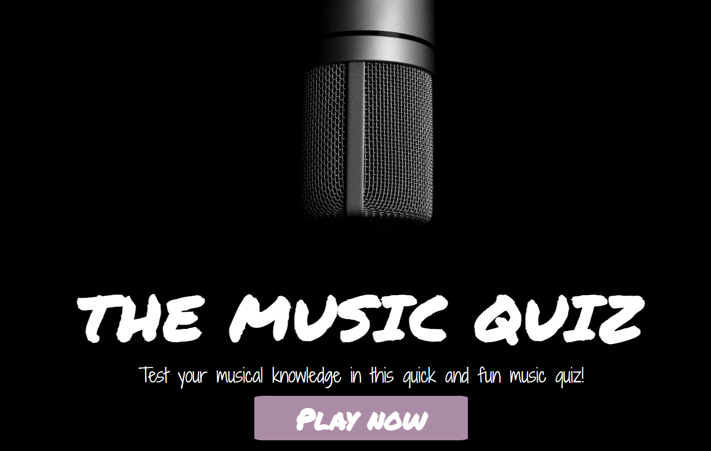

### **Navigation**  

 * To the left of the header user can find the link to the home page through a icon of a house/home.
 * On the right side the how-to-play button is located and matched by colors with the homepage link.
 * The header matches the rest of the website´s black background with icons and buttons in a lightpink for good contrast.
 * When user hovers the homepage link and how-to-play button the font changes to a dark grey and adds a box-shadow.

 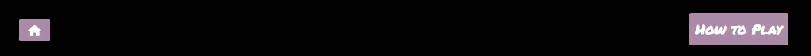
 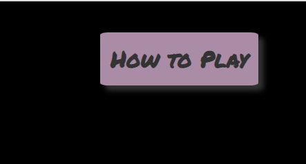

## **Game page**

### **The quiz**

* The quiz starts directly after user clicks the play-now button from homepage. 
* First question of the quiz will appear instantly and if user is unsure of how to play, user can access instructions in header of page.
* The Quiz consist's of questions with three options to choose from with only one of them beeing the right one.
* The next button is only visual after user has picked one option and therefor disable user from skipping questions.

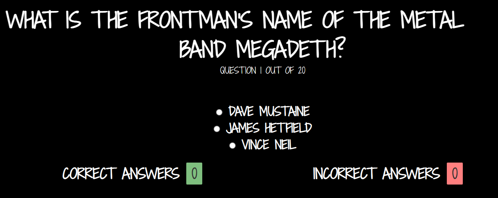     

### **Answer options**

* When user have clicked their option of answer, the quiz will control the answer and visually tell the user if they are right or wrong by turning the option red or green.   
Green if user is correct and red if user are wrong.  
* When user picks the right answer one point will be added to the correct answer box, and if user is wrong the point will instead be added to incorrect answer box.

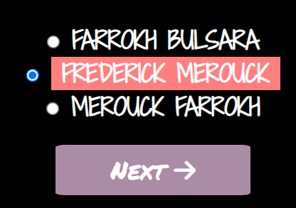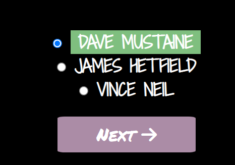  

### **Restart game**

* When all 20 questions is answered the next button will change into a restart button, where user can reload game.

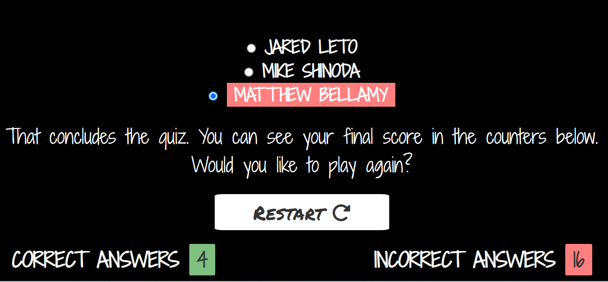 

### **How to play**
* The how to play button is always visual throughout the game.
* When clicked a new text box appears with instructions on how to play the music quiz.
* When the instructions on how to play is visual on the screen, everything else is hidden to minimize distractions from background elements.
* The color from the main image microphone is picked up as a background for the instructions in how to play, choosen to create good contrast between it and the white font.
* To exit the instructions and return to game, user can just click the x in the top right corner.

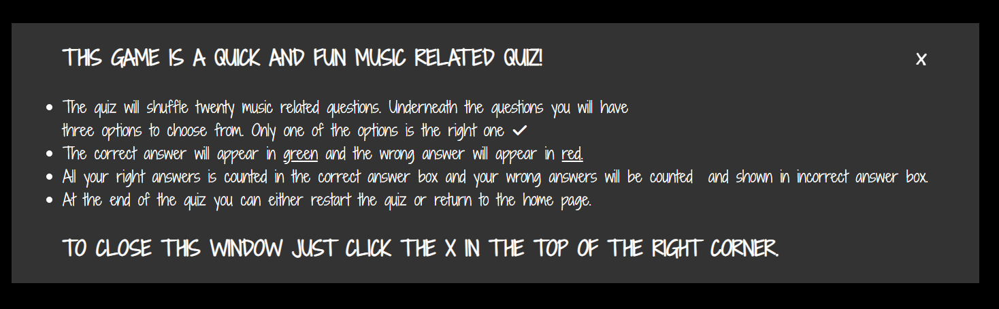

### **Score counters**

* Users correct and incorrect answers is counted at the bottom of the game page, user scores one point for each incident.
* The counters are visually matched with the red and green colors from the right and wrong answers, so when a answer turns red the counter adds one point to the red box in incorrect  
counter and vice versa for when user is right.

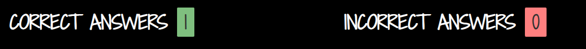

---

## **Testing**

* I tested that the page works in diffrent browsers such as Chrome, firefox and Microsoft Edge.
* I confirmed that this project is responsive, looks good and functions on all standard screen sizes using the devtools device toolbar.
* I confirmed that the header, navigation, main, how to play box, restart and next button's text are all readable and easy to understand.
* I have confirmed that the links between diffrent pages work and are accessible.

## **Bugs**

* No bugs.

---

## **Validator testing**

* **HTML**
3 errors occured since I did´nt use heading for the score-area section. When I replaced the paragraphs to h2 headings the code passed.
* **CSS**
No errors were found when passing through the official (Jigsaw) validator.
* **Javascript**
3 warnings occured in JShint validation testing, one of them was a unnecessary semicolon at the end of a function and was immediatly removed.   
One function uses Math.random and passes a decimal of 0.5 and the validation warned that the decimal could be confused as a dot, this warning was  
overlooked since the decimal is needed for the function to work correctly. The other warning was for the undefined variable "question" in the script.js  
but the variable can be found defined in questions.file instead.  
#### **The following metrics was returned from JShint:**  
- There are 22 functions in this file.
- Function with the largest signature take 2 arguments, while the median is 1.
- Largest function has 17 statements in it, while the median is 2.
- The most complex function has a cyclomatic complexity value of 4 while the median is 1.      
  

* **Accessability**
I confirmed that the colors and fonts chosen are easy to read and accessible by running it through lighthouse in devtools.

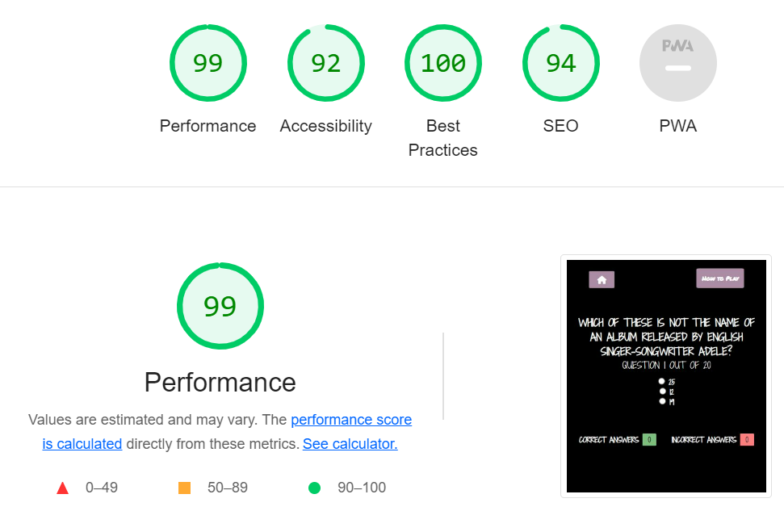

---

### **Unfixed Bugs**

* No unfixed bugs.

---

## **Deployment**

The site was deployed to GitHub pages. The steps to deploy are as follows:
* In the GitHub repository, navigate to the settings tab.
* From the source section drop-down menu, select the Master Branch.
* Once the master branch has been selected, the page provided the link to the completed website.

The live link can be found here - [Music Quiz](https://thereslundqvist.github.io/music-quiz/)

---

## **Credits**

### **Content**

* Questions and answers for Quiz come from [Open Trivia DB](https://opentdb.com/api_config.php)
* Icons for next and restart button come from [Font Awesome](https://fontawesome.com/)
* Fonts for page are imported from [Google fonts](https://fonts.google.com/) 

### **Media** 

* The main image is downloaded from [Pexels](https://www.pexels.com/sv-se/)

